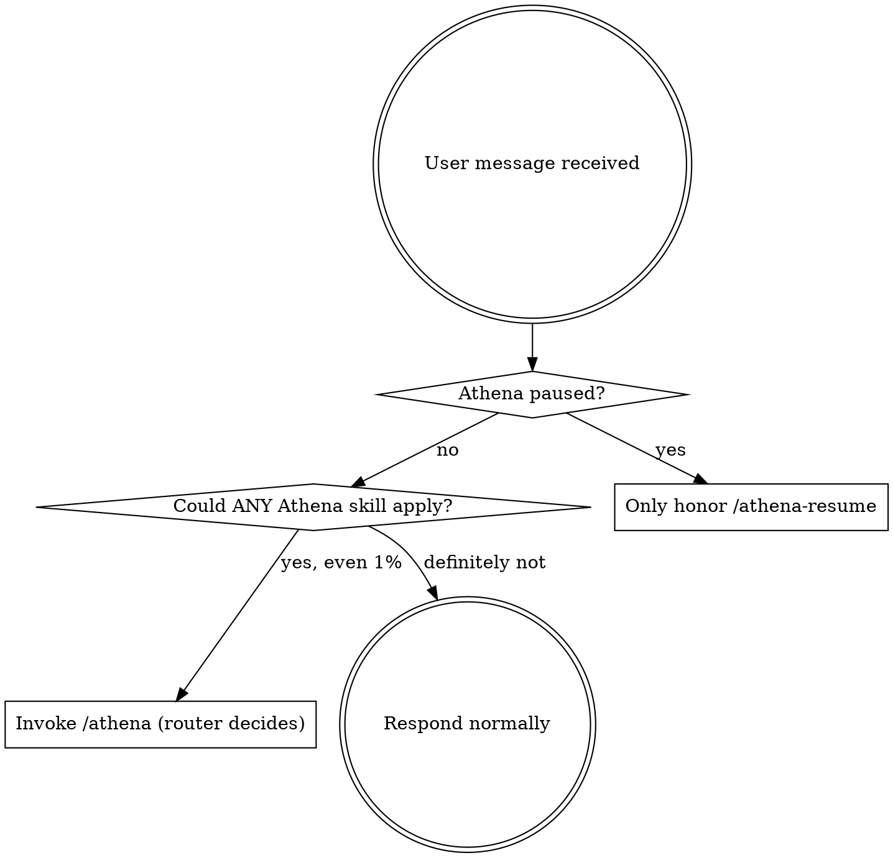

# Athena Init — Guardian

<SUBAGENT-STOP>
If you were dispatched as a subagent to execute a specific task, skip this skill. Your job is your task. Do not invoke `/athena` from inside a subagent; the parent already routed.
</SUBAGENT-STOP>

<EXTREMELY-IMPORTANT>
If you think there is even a **1% chance** an Athena skill might apply to what the user is asking for, you ABSOLUTELY MUST consult `/athena` (the router) first.

IF A ATHENA SKILL APPLIES TO THE TASK, YOU DO NOT HAVE A CHOICE. YOU MUST INVOKE IT.

This is not negotiable. This is not optional. You cannot rationalize your way out of this. "Quick" tasks become long tasks. "Simple" questions become brainstorms. Files-changes become migrations. The skill check costs nothing; skipping it costs rework.
</EXTREMELY-IMPORTANT>

## Instruction Priority

Athena skills override default behavior, but **user instructions always win**:

1. **User's explicit instructions** (CLAUDE.md, AGENTS.md, GEMINI.md, direct requests) — highest
2. **Athena skills** — override defaults where they conflict
3. **Default model/system behavior** — lowest

If CLAUDE.md says "skip the workflow for this repo," or the user says "just do it, don't route" — follow the user. The user is in control. Skills inform; users decide.

## Platform Adaptation

Athena skills use Claude Code tool names (`Read`, `Write`, `Edit`, `Bash`, `Grep`, `Glob`, `Task`, `Skill`, `TodoWrite`). On non-Claude-Code harnesses, substitute the equivalent for your platform — see the reference docs in this skill's directory:

- `references/codex-tools.md` — Codex (`spawn_agent` / `wait_agent` / `update_plan`)
- `references/copilot-tools.md` — Copilot CLI (`view` / `edit` / `task` / async shells)
- `references/gemini-tools.md` — Gemini CLI (`read_file` / `@generalist` / `activate_skill`)
- `references/opencode-tools.md` — OpenCode (`@mention` / native tools)

For subagent dispatch in `athena-build`, every harness has equivalent prompt-template handling — fill `{{PLACEHOLDERS}}` in `skills/athena-build/{implementer,spec-reviewer,code-quality-reviewer}-prompt.md` before dispatch.

## The Rule

**Before any response — including clarifying questions, including reads, including a single `ls` — check whether `/athena` should route this turn.**

Every user message gets a skill check. Every one.

## State Awareness

Before routing, check `.athena-state.json` in the project root:

- **`paused === true`** — Athena is disabled. Only honor `/athena-resume`. For everything else, respond normally without skill routing.
- **A pipeline phase exists** (e.g., `phase: "build"`, `phase: "build-stuck"`) — Use it to inform routing. The `/athena` router's state-aware rules handle this.
- **Missing file** — Normal behavior; route from intent alone.

This state file survives context compression. If you're unsure where you are in a workflow, **read it before guessing**.

## Red Flags — Thoughts That Mean You're Skipping The Check

| Thought | Reality |
|---|---|
| "This is just a simple question." | Questions are tasks. Check for skills. |
| "I need more context first." | Skill check comes BEFORE gathering context. Skills tell you HOW to gather it. |
| "Let me explore the codebase first." | Skills tell you HOW to explore. Check first. |
| "I can check git/files quickly." | Files lack conversation context. Check for skills. |
| "Let me gather information first." | Skills tell you HOW to gather information. |
| "This doesn't need a formal workflow." | If an Athena skill exists for it, use it. |
| "I remember this skill — I'll do it myself." | Skills evolve. Read the current version via the Skill tool. |
| "This doesn't count as a task." | Action = task. Check for skills. |
| "The skill is overkill for this." | Simple things become complex. Use it; the skill itself decides its own scale. |
| "I'll just do this one thing first." | Check BEFORE doing anything. |
| "This feels productive." | Undisciplined action wastes time. Skills prevent this. |
| "I know what the user means." | The user may have context you don't. Check. |
| "It's faster to just answer." | Wrong answers cost more time than skill checks. |

If you think one of these thoughts, **stop and invoke `/athena`**.

## Skill Priority

When multiple Athena skills could apply, use this order:

1. **Process skills first** — `/athena-brainstorm`, `/athena-debug`. These determine HOW to approach the task.
2. **Implementation skills second** — `/athena-plan`, `/athena-build`, `/athena-tdd`. These guide execution.
3. **Completion skills last** — `/athena-review`, `/athena-verify`, `/athena-ship`, `/athena-finish`. These wrap up.

"Let's build X" → brainstorm → plan → build.
"Fix this bug" → debug → tdd if needed.

## What NOT To Route

- Greetings, small talk, meta-questions about Athena itself.
- Direct requests to read a specific file (just read it).
- Pure git status / log lookups.
- When the user explicitly says "skip the workflow" or "just do it."
- When Athena is paused (`.athena-state.json` has `paused: true`) — except `/athena-resume`.

## Skill Types

**Rigid skills** (`athena-tdd`, `athena-debug`, `athena-verify`): Follow exactly. Discipline is the value. Don't adapt away the gates.

**Flexible skills** (`athena-brainstorm`, `athena-canvas`): Adapt principles to context. The skill itself tells you which.

## Rules

- **Always check before acting** — the cost of a 1-second check is zero; the cost of skipping is rework.
- **Never add your own instructions on top of a routed skill** — let the skill handle it.
- **Never skip the check because a previous turn didn't need routing** — every message is independent.
- **Respect the user** — if they say "skip the workflow," skip it. User instructions outrank skills.
- **Never invoke `/athena` from inside a dispatched subagent** — the parent already routed; subagents execute their task and report back.
