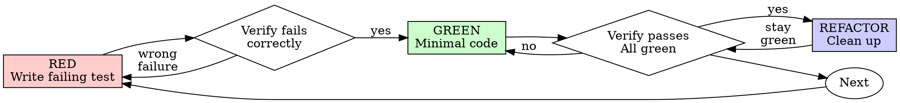

# Athena TDD — Test Driver

Enforced red-green-refactor. Each phase has a gate that must pass before proceeding.

## The Iron Law

```
NO PRODUCTION CODE WITHOUT A FAILING TEST FIRST
```

Write code before the test? Delete it. Start over.

**No exceptions:**
- Don't keep it as "reference"
- Don't "adapt" it while writing tests
- Don't look at it
- Delete means delete

Implement fresh from tests. Period.

## When to Use

**Always:**
- New features
- Bug fixes
- Refactoring
- Behavior changes

**Exceptions (ask your human partner):**
- Throwaway prototypes
- Generated code
- Configuration files

Thinking "skip TDD just this once"? Stop. That's rationalization.

## The Cycle



### RED — Write a Failing Test

1. Identify the next behavior to implement (one small behavior at a time)
2. Write a test that describes the expected behavior
3. **GATE: Run the test. It MUST fail.**
   - If it passes → you're testing existing behavior, not new behavior. Write a different test.
   - If it errors (won't compile/import) → that's acceptable, it's still "red"
   - If it fails for the wrong reason (typo, import error) → fix the error, re-run until it fails correctly

Show the test code and the failure output before proceeding.

<Good>
```typescript
test('retries failed operations 3 times', async () => {
  let attempts = 0;
  const operation = () => {
    attempts++;
    if (attempts < 3) throw new Error('fail');
    return 'success';
  };

  const result = await retryOperation(operation);

  expect(result).toBe('success');
  expect(attempts).toBe(3);
});
```
Clear name, tests real behavior, one thing
</Good>

<Bad>
```typescript
test('retry works', async () => {
  const mock = jest.fn()
    .mockRejectedValueOnce(new Error())
    .mockRejectedValueOnce(new Error())
    .mockResolvedValueOnce('success');
  await retryOperation(mock);
  expect(mock).toHaveBeenCalledTimes(3);
});
```
Vague name, tests mock not code
</Bad>

**Requirements:**
- One behavior per test
- Clear name describing the behavior
- Real code (no mocks unless unavoidable)

### GREEN — Make It Pass

1. Write the **minimum code** to make the failing test pass
2. Don't write elegant code — write working code
3. Don't implement features the test doesn't require
4. **GATE: Run the test. It MUST pass.**
   - If it fails → fix the implementation (not the test)
   - Only proceed when green

Show the implementation and the passing output before proceeding.

<Good>
```typescript
async function retryOperation<T>(fn: () => Promise<T>): Promise<T> {
  for (let i = 0; i < 3; i++) {
    try {
      return await fn();
    } catch (e) {
      if (i === 2) throw e;
    }
  }
  throw new Error('unreachable');
}
```
Just enough to pass
</Good>

<Bad>
```typescript
async function retryOperation<T>(
  fn: () => Promise<T>,
  options?: {
    maxRetries?: number;
    backoff?: 'linear' | 'exponential';
    onRetry?: (attempt: number) => void;
  }
): Promise<T> {
  // YAGNI — the test didn't ask for any of this
}
```
Over-engineered
</Bad>

Don't add features, refactor other code, or "improve" beyond the test.

### REFACTOR — Clean Up

1. Now improve the code — extract functions, rename variables, remove duplication
2. Do NOT add new behavior during refactor
3. **GATE: Run ALL tests. They MUST still pass.**
   - If anything fails → the refactor broke something. Undo and try again.

Show what you refactored and the full test output before proceeding.

### Repeat

Move to the next behavior. Each cycle should be small — 2-5 minutes.

## What "Minimum Code" Means

- If the test expects `return 5`, write `return 5` — don't write the general algorithm yet
- If the test expects a list with one item, handle one item — don't write the loop yet
- The NEXT test will force you to generalize
- This feels wrong but it prevents over-engineering

## Good Tests

| Quality | Good | Bad |
|---------|------|-----|
| **Minimal** | One thing. "and" in name? Split it. | `test('validates email and domain and whitespace')` |
| **Clear** | Name describes behavior | `test('test1')` |
| **Shows intent** | Demonstrates desired API | Obscures what code should do |

## When to Stop

- All specified behaviors have tests and pass
- You can't think of another meaningful test case
- The user says "that's enough"

## Tracking

Show the cycle state:
```
TDD Cycle 3/~5
═══════════════
Behavior: "returns empty list when no items match filter"
Phase: GREEN ✓ → REFACTOR
Tests: 7 passing, 0 failing
```

## Why Order Matters

**"I'll write tests after to verify it works"**

Tests written after code pass immediately. Passing immediately proves nothing:
- Might test wrong thing
- Might test implementation, not behavior
- Might miss edge cases you forgot
- You never saw it catch the bug

Test-first forces you to see the test fail, proving it actually tests something.

**"I already manually tested all the edge cases"**

Manual testing is ad-hoc. You think you tested everything but:
- No record of what you tested
- Can't re-run when code changes
- Easy to forget cases under pressure
- "It worked when I tried it" ≠ comprehensive

Automated tests are systematic. They run the same way every time.

**"Deleting X hours of work is wasteful"**

Sunk cost fallacy. The time is already gone. Your choice now:
- Delete and rewrite with TDD (X more hours, high confidence)
- Keep it and add tests after (30 min, low confidence, likely bugs)

The "waste" is keeping code you can't trust.

**"TDD is dogmatic, being pragmatic means adapting"**

TDD IS pragmatic:
- Finds bugs before commit (faster than debugging after)
- Prevents regressions (tests catch breaks immediately)
- Documents behavior (tests show how to use code)
- Enables refactoring (change freely, tests catch breaks)

"Pragmatic" shortcuts = debugging in production = slower.

**"Tests after achieve the same goals — it's spirit not ritual"**

No. Tests-after answer "What does this do?" Tests-first answer "What should this do?"

Tests-after are biased by your implementation. You test what you built, not what's required. You verify remembered edge cases, not discovered ones.

Tests-first force edge case discovery before implementing. Tests-after verify you remembered everything (you didn't).

## When Stuck

| Problem | Solution |
|---------|----------|
| Don't know how to test | Write wished-for API. Write assertion first. Ask your human partner. |
| Test too complicated | Design too complicated. Simplify interface. |
| Must mock everything | Code too coupled. Use dependency injection. |
| Test setup huge | Extract helpers. Still complex? Simplify design. |

## Debugging Integration

Bug found? Write a failing test that reproduces it. Follow the TDD cycle. The test proves the fix works and prevents regression.

**Never fix bugs without a test.** The test IS the proof the bug existed and is now gone.

## Example: Bug Fix

**Bug:** Empty email accepted by form

**RED**
```typescript
test('rejects empty email', async () => {
  const result = await submitForm({ email: '' });
  expect(result.error).toBe('Email required');
});
```

**Verify RED**
```bash
$ npm test
FAIL: expected 'Email required', got undefined
```
Good — fails because the feature is missing, not because of a typo.

**GREEN**
```typescript
function submitForm(data: FormData) {
  if (!data.email?.trim()) {
    return { error: 'Email required' };
  }
  // ...existing code
}
```

**Verify GREEN**
```bash
$ npm test
PASS (all 12 tests)
```

**REFACTOR**
Extract validation into a shared validator if multiple fields need it.

**Verify REFACTOR**
```bash
$ npm test
PASS (all 12 tests)
```

## Verification Checklist (before claiming done)

- [ ] Every new function/behavior has at least one test
- [ ] Watched each test fail before implementing (RED gate)
- [ ] Each test failed for expected reason (feature missing, not typo)
- [ ] Wrote minimum code for each test (GREEN gate)
- [ ] All tests pass after refactor (REFACTOR gate)
- [ ] No unnecessary mocks — use real code where possible
- [ ] Edge cases covered (empty input, boundary values, error paths)
- [ ] Test output is clean — no warnings, no skipped tests

Can't check all boxes? You skipped TDD. Start over.

## Rationalization Table

| Excuse | Reality |
|--------|---------|
| "Too simple to test" | Simple code breaks. The test takes 30 seconds. |
| "I'll test after" | Tests-after pass immediately and prove nothing. |
| "Tests after achieve the same goals" | Tests-after = "what does this do?" Tests-first = "what should this do?" Different questions. |
| "I already manually tested it" | Manual tests die with the session. Automated tests live forever. |
| "This is just a refactor" | Refactors break things. The test proves they don't. |
| "It's about the spirit, not the ritual" | **Violating the letter of the rules IS violating the spirit.** |
| "Deleting X hours is wasteful" | Sunk cost fallacy. Keeping unverified code is technical debt. |
| "Keep as reference, write tests first" | You'll adapt it. That's testing after. Delete means delete. |
| "Need to explore first" | Fine. Throw away exploration, start with TDD. |
| "Test hard = skip it" | Listen to the test. Hard to test = hard to use. Fix the design. |
| "TDD will slow me down" | TDD is faster than debugging. Pragmatic = test-first. |
| "Existing code has no tests" | You're improving it. Add tests for the code you touch. |

## Red Flags — STOP and Start Over

If you catch yourself thinking any of these, delete the code and start with a test:

- Writing implementation code before a test exists
- A test passing immediately on first run
- "I'll add the test after I get this working"
- Keeping old implementation code as "reference"
- "Just this once, I'll skip the test"
- "This is different because..."
- "I already manually tested it"
- "Tests after achieve the same purpose"
- "It's about spirit not ritual"
- "Already spent X hours, deleting is wasteful"
- "TDD is dogmatic, I'm being pragmatic"

**All of these mean: Delete code. Start over with RED.**

## Testing Anti-Patterns

- **Testing mock behavior instead of real behavior** — if your test only verifies mock calls, it proves nothing about your code
- **Adding test-only methods to production classes** — tests should use the public API
- **Mocking without understanding dependencies** — mock boundaries (external services, I/O), not your own code
- **Testing implementation details** — test behavior and outcomes, not internal state

## Rules

- **Never write implementation before a failing test** — this is the hardest rule and the most important
- **Never skip the refactor phase** — even if the code "looks fine", take 30 seconds to look
- **Never fix a test to make it pass** — if the test is correct, fix the implementation
- **Small cycles** — if a cycle takes more than 5 minutes, the behavior is too big. Split it.
- **No unnecessary mocks** — mock external services, not your own code
- **Clean output** — zero warnings, zero skipped tests

## Final Rule

```
Production code → test exists and failed first
Otherwise → not TDD
```

No exceptions without your human partner's permission.
